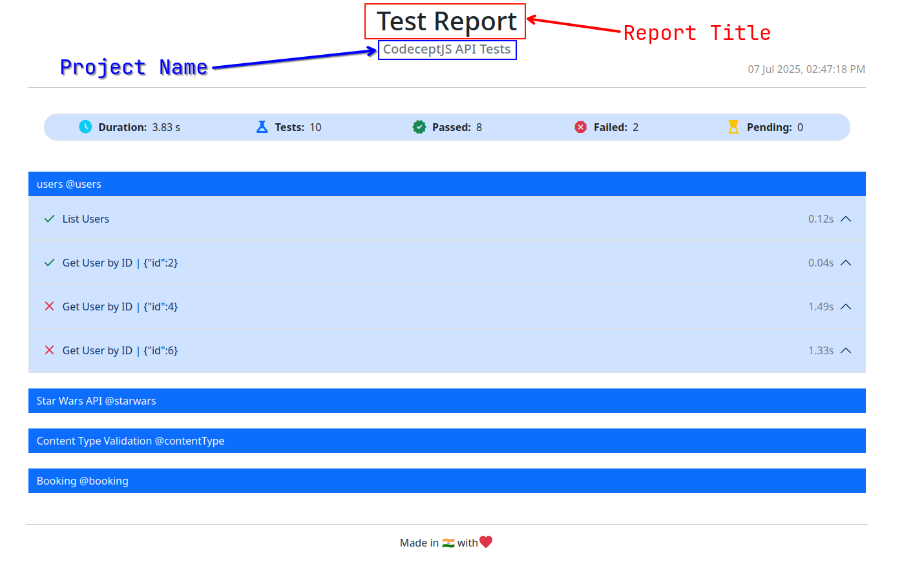

## About

This repository contains an automated test framework example for API Testing.

The framework uses [codeceptjs](https://codecept.io/).

The framework also utilizes following assertion libraries.

- [ joi ](https://joi.dev/)
- [ codeceptjs-chai ](https://www.npmjs.com/package/codeceptjs-chai)

## How to run tests

1. Download the zip file or clone this repository.
2. Change the directory to `codeceptjs-api-tests`.

   ```sh
   cd codeceptjs-api-tests
   ```

3. Install dependencies.

   ```sh
   npm install
   ```

4. Run tests.

   ```sh
   # Run all the tests/scenarios.
   npm run test

   # Run all the tests/scenarios in "PARALLEL".
   npm run test:parallel

   # Run all tests with @booking tag.
   npm codeceptjs run --grep "@booking" --steps

   # Run all tests with @users tag.
   npm codeceptjs run --grep "@users" --steps

   # Run all tests with @starwars tag.
   npm codeceptjs run --grep "@starwars" --steps

   # Run all tests with @contentType tag.
   npm codeceptjs run --grep "@contentType" --steps
   ```

5. A HTML report is saved in `reports` directory after a successful test run.


## Parallel Test Report

When you run all the tests in parallel by running `npm run test:parallel`, instead of a regular 'report.html' file, a `parallel-report.html` HTML report is generated.

You can configure this `Parallel Test Report` using its configuration options in `codecept.conf.ts`. Below are the configuration options that you can provide value - to customize the report generation. 

```ts
  plugins: {
    ParallelReport: {
      outputDir: './custom-reports-directory', // Optional. If not provided, takes 'output' field from codecept.conf.ts as default, i.e. 'output'.
      fileName: 'my-report.html', // Optional. If not provided, uses 'parallel-report.html' as default.
      projectName: 'My Cool Project' // Optional. If not provided, takes 'name' field from codecept.conf.ts as default, i.e. 'codeceptjs-api-tests'.
      reportTitle: 'Test Report' // Optional. If not provided, uses 'Test Report' as default.
    }
  },
```

All four configuration options listed above are optional. If they are not provided in config file, their respective default values are considered while generating the report. However, it is recommended that you provide values for at least `projectName` property. Refer to the screenshot below to know where and how it is displayed in the report.
<br />
<br />

